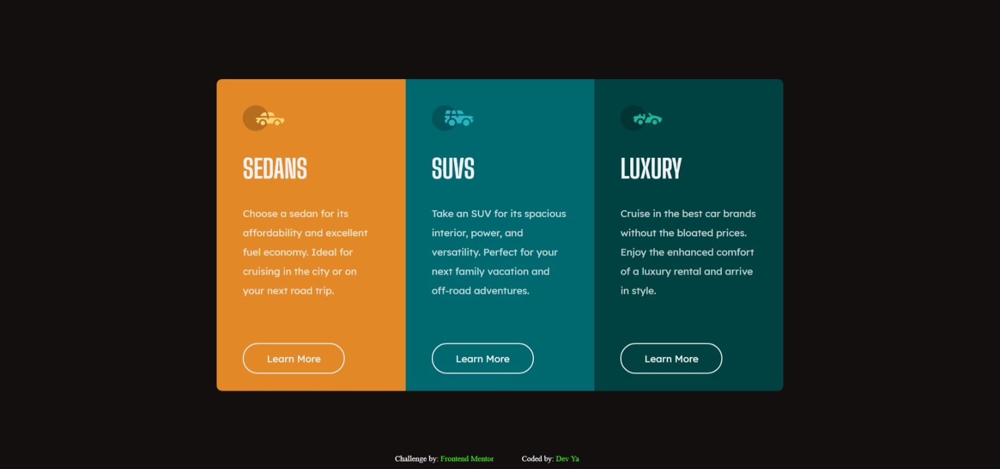

# Frontend Mentor - 3-column preview card component solution

This is a solution to the [3-column preview card component challenge on Frontend Mentor](https://www.frontendmentor.io/challenges/3column-preview-card-component-pH92eAR2-). Frontend Mentor challenges help you improve your coding skills by building realistic projects.

## Table of contents

- [Overview](#overview)
  - [The challenge](#the-challenge)
  - [Screenshot](#screenshot)
  - [Links](#links)
  - [Built with](#built-with)
  - [What I learned](#what-i-learned)
  - [Continued development](#continued-development)
  - [Useful resources](#useful-resources)
- [Author](#author)

## Overview

### The challenge

Users should be able to:

- View the optimal layout depending on their device's screen size
- See hover states for interactive elements

### Screenshot

### Links

- Solution URL: [Add solution URL here](https://your-solution-url.com)
- Live Site URL: [Add live site URL here](https://your-live-site-url.com)

### Built with

- Semantic HTML5 markup
- CSS custom properties
- Flexbox
- Mobile-first workflow

### What I learned

i've learned in this prject how to manipulate the Flexbox property and make the better of it.

### Continued development

i want to focus more on responsiveness although i have a good grasp of it, i need to practice it more.

### Useful resources

- [W3schools resource ](https://www.w3schools.com/) - This helped me a lot to customize my css. I really liked this pattern and will use it going forward.
- [slack overflow resource ](https://slackoverflow.com) - i've found an amazing article in this website which helped me finally fix some flexbox bugs. I'd recommend it to anyone still learning this concept.

## Author

- Frontend Mentor - [@yacine1996](https://www.frontendmentor.io/profile/yacine1996)
